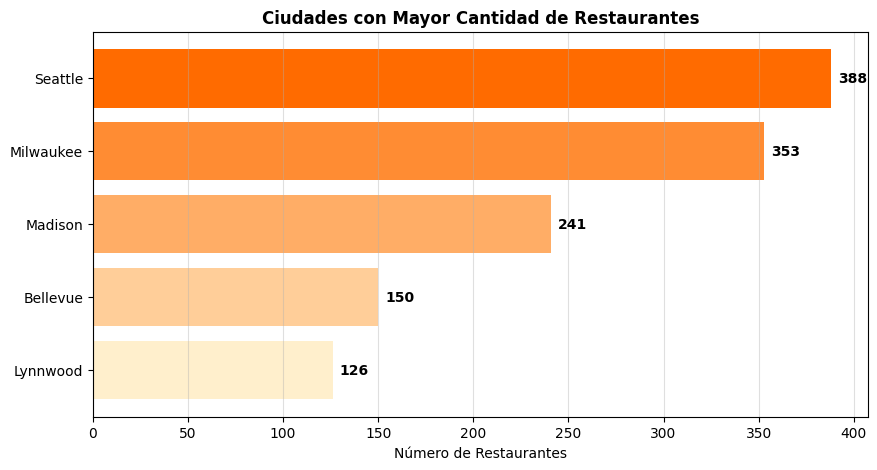
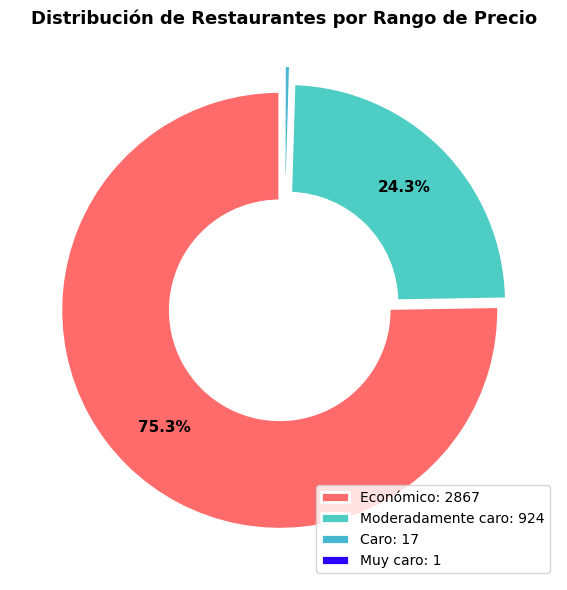
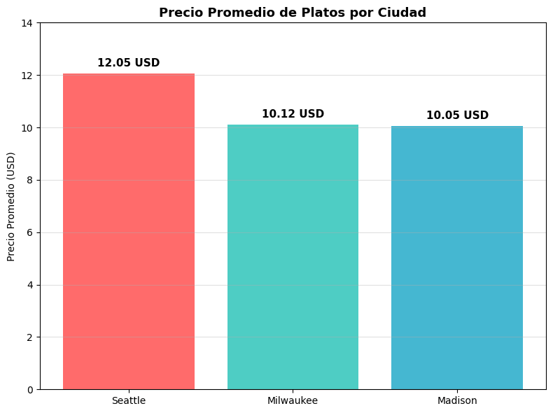
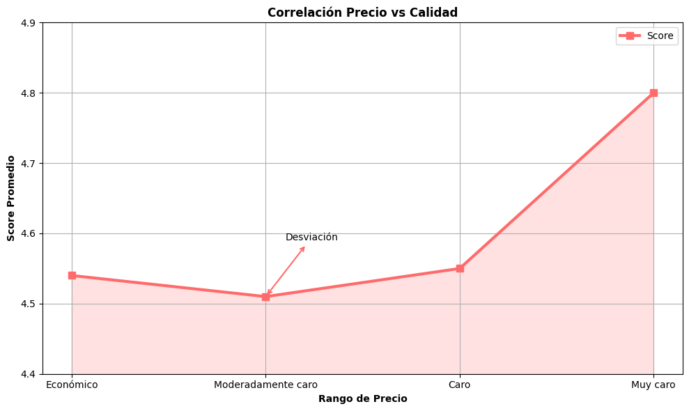

# 🚀 Pipeline ETL & Inteligencia de Mercado — Food Delivery USA

Este proyecto presenta un análisis integral del mercado de food delivery 
en Estados Unidos, documentando todo el ciclo de vida de los datos: 
desde la **extracción y limpieza (ETL)** hasta la **visualización 
estratégica** orientada a la toma de decisiones del CEO.

---

## 🧑‍💻 Tecnologías Utilizadas
- **Lenguaje:** Python, SQL (SQLite)
- **Bibliotecas:** `Pandas`, `NumPy`, `Matplotlib`, `SQLAlchemy`
- **Base de Datos:** SQLite (`delivery_insights.db`)
- **Entorno:** Google Colab (`.ipynb`)

---

## 📐 Arquitectura del Pipeline

| Fase | Descripción |
|:-----|:------------|
| **Extract** | Carga de `restaurants.csv` y 10 archivos de menús mediante bucle automático |
| **Transform** | Limpieza de precios, mapeo de rangos, split de direcciones y filtros de calidad |
| **Load** | Carga a base de datos SQLite mediante SQLAlchemy |
| **BI** | 4 queries SQL con visualizaciones estratégicas en Matplotlib |

---

## 🗄️ Datasets Utilizados

| Archivo | Descripción | Registros Aprox. |
|:--------|:------------|:-----------------|
| `data/restaurants.csv` | Catálogo maestro de restaurantes | 63,000 |
| `data/restaurant_menus_parte_1 al 10.csv` | Detalle de ítems de menú dividido en 10 partes | 900,000 |

---

## 🔧 Transformaciones Aplicadas

| Transformación | Detalle |
|:---------------|:--------|
| **Mapeo de precios** | `$` → `Económico`, `$$` → `Moderadamente caro`, etc. |
| **Split de direcciones** | Separación de `full_address` en `calle`, `ciudad` y `estado_zip` |
| **Limpieza de precios** | Conversión de `"15.99 USD"` a `float` |
| **Filtro de calidad** | Eliminación de restaurantes sin score o con score = 0 |
| **INNER JOIN** | Cruce entre restaurantes y menús por `id` de restaurante |

---

## 📊 Resultados y Visualizaciones

| # | Pregunta | Insight | Gráfico |
|:--|:---------|:--------|:--------|
| 1 | 🏙️ Penetración Geográfica | Seattle lidera con 388 restaurantes |  |
| 2 | 💰 Distribución de Precios | El 75% opera en segmento Económico |  |
| 3 | 🍽️ Precio Promedio por Ciudad | Seattle lidera con $12.05 USD promedio |  |
| 4 | ⭐ Correlación Precio vs Calidad | Correlación 0.79 — precio no garantiza calidad |  |
---

## 💡 Conclusión Estratégica

> **Lanzar en Seattle, posicionarse en segmento económico y apostar por calidad — esa combinación captura el mayor volumen del mercado con el menor riesgo.**

- **Seattle** es la ciudad prioritaria — lidera en cantidad de restaurantes y precio promedio
- El **75%** del mercado es económico — el volumen está en lo accesible
- Los restaurantes **económicos superan en score** a los moderadamente caros
- Un precio más alto **no garantiza** mejor experiencia al usuario

---

## 📁 Estructura del Repositorio

```text
Proyecto-Pipeline-Business-Intelligence---Food-Delivery/
├── data/
│   ├── restaurants.csv
│   ├── restaurant_menus_parte_1.csv
│   ├── restaurant_menus_parte_2.csv
│   ├── ...
│   └── restaurant_menus_parte_10.csv
├── img/
│   ├── img1.png
│   ├── img2.png
│   ├── img3.png
│   └── img4.png
├── ProyectoIntegrador.ipynb
└── README.md
```

---

## 👤 Autor
**Juan Pablo Mendoza Granda**  
